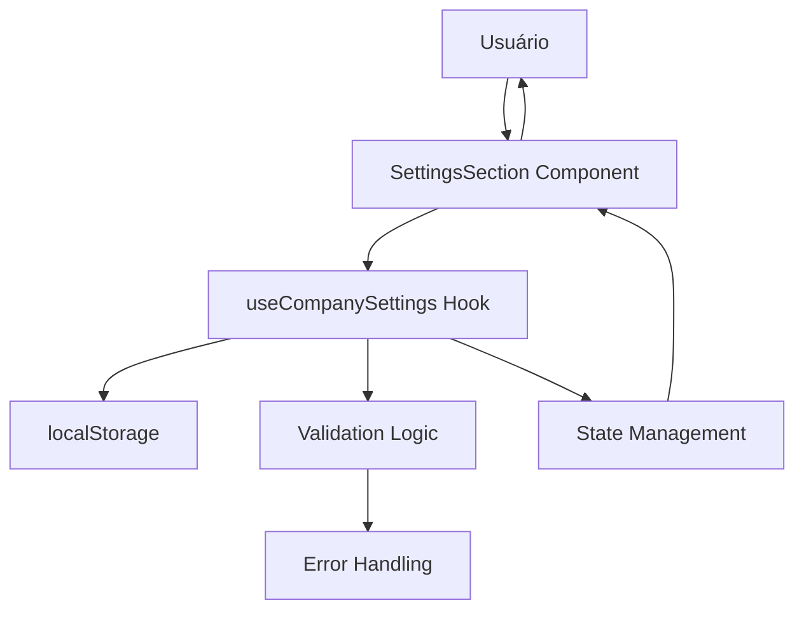

# Sistema de Configurações da Empresa

Este documento descreve o sistema de gerenciamento de configurações da empresa implementado para o painel administrativo do sistema de cardápio digital.

## 📁 Estrutura de Arquivos

```
src/
├── hooks/
│   ├── useCompanySettings.js     # Hook principal para gerenciamento
│   └── __tests__/
│       └── useCompanySettings.test.js  # Testes do hook
├── components/admin/sections/
│   ├── SettingsSection.js        # Interface do usuário
│   └── __tests__/
│       └── SettingsSection.test.js     # Testes do componente
└── docs/
    └── CompanySettingsSystem.md  # Esta documentação
```

## 🎯 Funcionalidades

### ✅ Configurações da Empresa
- **Informações Básicas**: Nome, descrição, logo
- **Endereço**: Endereço completo, cidade, estado, CEP
- **Contato**: Telefone, WhatsApp, e-mail, website
- **Redes Sociais**: Facebook, Instagram
- **Horários de Funcionamento**: Configuração para cada dia da semana
- **Upload de Logo**: Suporte a imagens até 5MB

### ✅ Validação de Dados
- Campos obrigatórios marcados com asterisco
- Validação de formato de e-mail
- Validação de horários de funcionamento
- Validação de tamanho e tipo de arquivo para logo

### ✅ Persistência
- Armazenamento local via localStorage
- Carregamento automático de dados salvos
- Indicadores visuais de estado (salvando, sucesso, erro)

## 🔧 Como Usar

### Hook useCompanySettings

```javascript
import { useCompanySettings } from '@/hooks/useCompanySettings';

function MyComponent() {
  const {
    companyData,          // Dados atuais da empresa
    loading,              // Estado de carregamento
    saving,               // Estado de salvamento
    error,                // Mensagem de erro
    success,              // Indicador de sucesso
    hasChanges,           // Indica se há mudanças não salvas
    updateField,          // Função para atualizar campos
    updateSchedule,       // Função para atualizar horários
    saveCompanySettings,  // Função para salvar
    uploadLogo,           // Função para upload de logo
    validateCompanyData,  // Função de validação
    clearError,           // Limpar erros
    resetToDefaults       // Resetar para padrão
  } = useCompanySettings();

  // Atualizar campo
  const handleNameChange = (newName) => {
    updateField('name', newName);
  };

  // Atualizar horário
  const handleScheduleChange = (day, field, value) => {
    updateSchedule(day, field, value);
  };

  // Salvar configurações
  const handleSave = async () => {
    await saveCompanySettings();
  };

  return (
    // Sua interface aqui
  );
}
```

### Hook usePublicCompanyData (Somente Leitura)

```javascript
import { usePublicCompanyData } from '@/hooks/useCompanySettings';

function PublicComponent() {
  const { companyData, loading } = usePublicCompanyData();

  if (loading) return <div>Carregando...</div>;

  return (
    <div>
      <h1>{companyData?.name}</h1>
      <p>{companyData?.description}</p>
      {/* Demais dados da empresa */}
    </div>
  );
}
```

## 📊 Estrutura de Dados

### CompanyData Schema

```typescript
interface CompanyData {
  // Informações básicas
  name: string;              // Nome da empresa (obrigatório)
  description: string;       // Descrição da empresa
  logo: string;              // URL ou caminho da logo

  // Endereço
  address: string;           // Endereço completo (obrigatório)
  city: string;              // Cidade (obrigatório)
  state: string;             // Estado (obrigatório)
  zipCode: string;           // CEP

  // Contato
  phone: string;             // Telefone (obrigatório)
  whatsapp: string;          // WhatsApp
  email: string;             // E-mail (obrigatório)
  website: string;           // Website

  // Redes sociais
  facebook: string;          // Facebook
  instagram: string;         // Instagram

  // Horários de funcionamento
  schedule: {
    [day: string]: {
      open: string;          // Horário de abertura (HH:mm)
      close: string;         // Horário de fechamento (HH:mm)
      closed: boolean;       // Se está fechado no dia
    }
  }
}
```

### Dias da Semana

```javascript
const daysOfWeek = {
  monday: 'Segunda-feira',
  tuesday: 'Terça-feira',
  wednesday: 'Quarta-feira',
  thursday: 'Quinta-feira',
  friday: 'Sexta-feira',
  saturday: 'Sábado',
  sunday: 'Domingo'
};
```

## 🧪 Testes

### Cobertura de Testes do Hook

- **Estado Inicial**: ✅ 2 testes
- **Atualização de Dados**: ✅ 3 testes
- **Validação de Dados**: ✅ 4 testes
- **Persistência**: ✅ 2 testes
- **Upload de Logo**: ✅ 3 testes
- **Funções Utilitárias**: ✅ 2 testes
- **Hook Público**: ✅ 2 testes

**Total**: 18 testes passando com 96.14% de cobertura

### Executar Testes

```bash
# Testes específicos do sistema
npm test -- --testPathPatterns="useCompanySettings"

# Todos os testes
npm test
```

## 🎨 Interface do Usuário

### Componente SettingsSection

O componente principal utiliza uma interface com abas:

1. **Aba Empresa**: Configurações da empresa
   - Formulário de informações básicas
   - Upload de logo com preview
   - Configuração de horários de funcionamento
   - Redes sociais

2. **Aba Sistema**: Configurações do sistema (futuro)
   - Placeholder para futuras configurações

### Características da UI

- **Design Responsivo**: Funciona em desktop e mobile
- **Validação em Tempo Real**: Feedback imediato de erros
- **Estados Visuais**: Loading, sucesso, erro claramente indicados
- **Accessibility**: Suporte a navegação por teclado e screen readers

## 🔄 Fluxo de Dados



## 🚀 Integração com o Sistema

### Exibição Pública

Para exibir as informações da empresa na parte pública do site:

```javascript
import { usePublicCompanyData } from '@/hooks/useCompanySettings';

function RestaurantInfo() {
  const { companyData } = usePublicCompanyData();

  return (
    <div>
      <h2>{companyData?.name}</h2>
      <p>{companyData?.description}</p>
      <p>📞 {companyData?.phone}</p>
      <p>📧 {companyData?.email}</p>
      <p>📍 {companyData?.address}, {companyData?.city}</p>
      
      {/* Horários de funcionamento */}
      <div>
        <h3>Horários de Funcionamento</h3>
        {Object.entries(companyData?.schedule || {}).map(([day, schedule]) => (
          <p key={day}>
            {day}: {schedule.closed ? 'Fechado' : `${schedule.open} - ${schedule.close}`}
          </p>
        ))}
      </div>
    </div>
  );
}
```

## 📋 Validações Implementadas

### Campos Obrigatórios
- Nome da empresa
- Endereço
- Cidade
- Estado
- Telefone
- E-mail

### Validações Específicas
- **E-mail**: Formato válido
- **Horários**: Abertura antes do fechamento
- **Logo**: Tipo de arquivo (imagem) e tamanho (máx 5MB)

### Mensagens de Erro
- Mensagens claras e específicas
- Exibição não-intrusiva
- Opção de fechar manualmente

## 🔧 Configuração e Manutenção

### Adicionar Novos Campos

1. Atualizar `DEFAULT_COMPANY_DATA` no hook
2. Adicionar validação se necessário
3. Atualizar interface do usuário
4. Adicionar testes

### Exemplo de Novo Campo

```javascript
// No hook useCompanySettings.js
const DEFAULT_COMPANY_DATA = {
  // ... campos existentes
  newField: '', // Novo campo
};

// Na validação
if (!data.newField?.trim()) {
  errors.push('Novo campo é obrigatório');
}

// No componente SettingsSection.js
<TextField
  label="Novo Campo"
  value={companyData.newField}
  onChange={(e) => updateField('newField', e.target.value)}
  required
/>
```

## 🚨 Limitações Conhecidas

1. **Armazenamento**: Atualmente usa localStorage (limitado a ~5MB)
2. **Upload de Logo**: Preview local apenas, requer integração com servidor para produção
3. **Backup**: Sem backup automático dos dados
4. **Sincronização**: Não sincroniza entre diferentes dispositivos/sessões

## 🛠️ Próximos Passos

### Melhorias Planejadas

1. **Integração com Backend**
   - API para persistência de dados
   - Upload de imagens para servidor
   - Sincronização entre dispositivos

2. **Funcionalidades Avançadas**
   - Export/import de configurações
   - Backup automático
   - Histórico de alterações
   - Múltiplos perfis de empresa

3. **Interface**
   - Editor de logo integrado
   - Pré-visualização da página pública
   - Configurações avançadas de horários (feriados, etc.)

4. **Validação**
   - Validação de CEP
   - Verificação de links de redes sociais
   - Validação de telefone/WhatsApp

---

## 📞 Suporte

Para dúvidas ou problemas com o sistema de configurações da empresa:

1. Verifique os testes para exemplos de uso
2. Consulte o código-fonte dos hooks
3. Execute os testes para validar funcionalidades
4. Documente novos bugs encontrados

**Última atualização**: 20/08/2025  
**Versão**: 1.0.0  
**Status**: ✅ Produção
